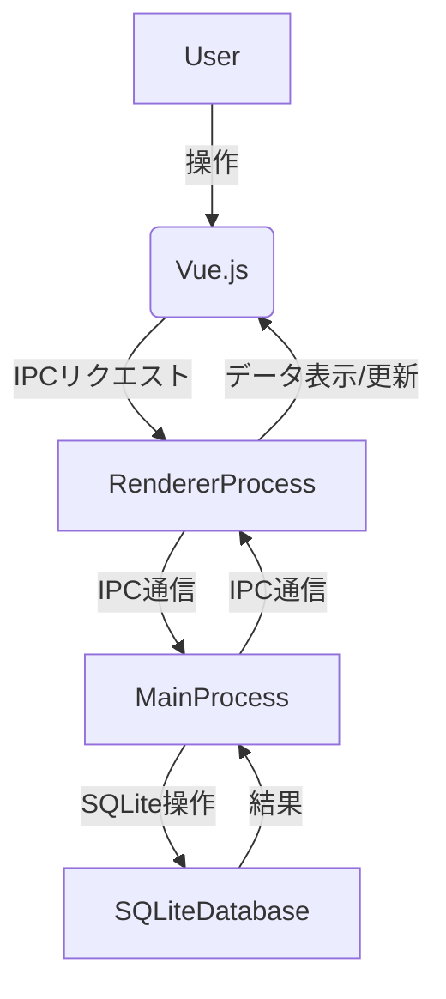

# アーキテクチャ概要

## 概要
本アプリケーションの全体的なアーキテクチャと主要コンポーネント間の連携について説明します。

## 主要コンポーネント
- **Electron**: デスクトップアプリケーションのシェルを提供し、Web技術（HTML, CSS, JavaScript/Vue.js）でUIを構築します。
- **Vue.js**: フロントエンドのUIを構築するためのプログレッシブJavaScriptフレームワークです。コンポーネントベースのアプローチで開発を進めます。
- **SQLite**: アプリケーションのローカルデータを永続化するための軽量なリレーショナルデータベースです。Electronのメインプロセスからアクセスし、IPC (Inter-Process Communication) を通じてレンダラープロセスとデータのやり取りを行います。

## データフローの概要
1.  **UI (Vue.js)**: ユーザーはVue.jsで構築されたUIを通じて戦績データの入力、表示、編集を行います。
2.  **レンダラープロセス**: UIからの操作はレンダラープロセスで処理されます。データ操作（保存、読み込み、更新、削除）が必要な場合、IPCを通じてメインプロセスにリクエストを送信します。
3.  **メインプロセス**: レンダラープロセスからのリクエストを受け取り、SQLiteデータベースへのアクセスを仲介します。データベース操作の結果をレンダラープロセスに返します。
4.  **SQLiteデータベース**: メインプロセスからの指示に従い、戦績データを永続的に保存・管理します。

## ディレクトリ構造 (予定)
- `src/main`: Electronのメインプロセス関連のコード
- `src/preload`: メインプロセスとレンダラープロセス間の安全な通信を確立するためのプリロードスクリプト
- `src/renderer`: Vue.jsアプリケーションのコード
  - `src/renderer/src/components`: Vueコンポーネント
  - `src/renderer/src/views`: ルーティングされるページコンポーネント
  - `src/renderer/src/store`: Vuex (またはPinia) による状態管理
  - `src/renderer/src/router`: Vue Routerによるルーティング
- `docs`: ドキュメント類
- `build`: ビルド関連ファイル
